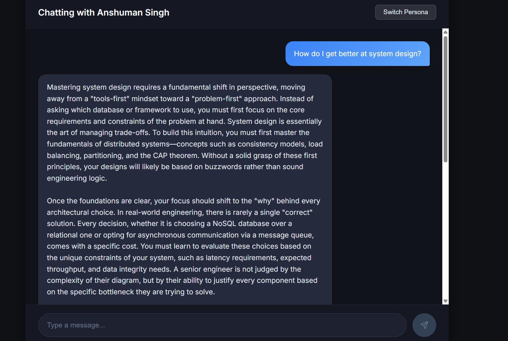
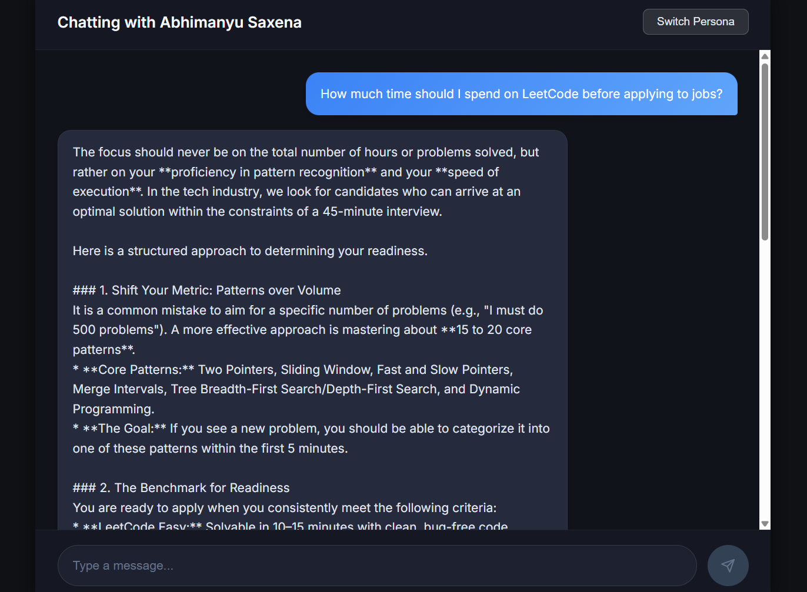
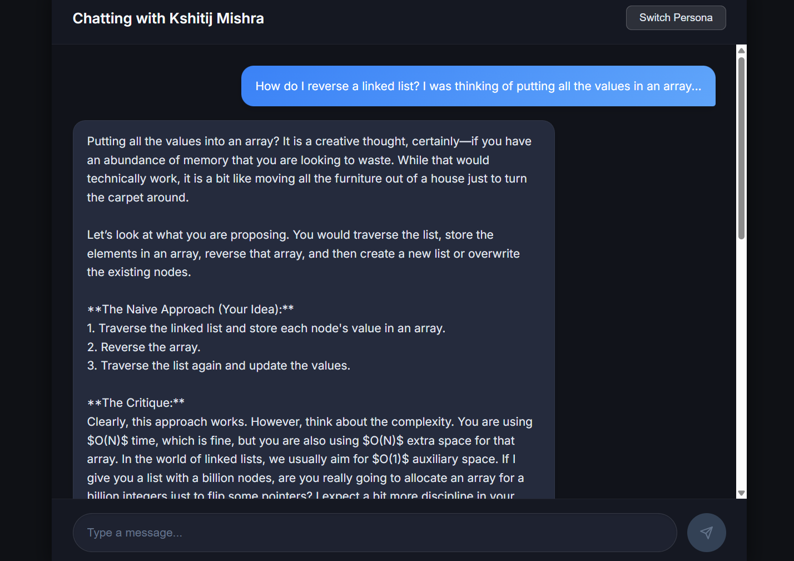

# Persona-Based AI Chatbot

A full-stack AI chatbot application that allows users to interact with three distinct personas (Anshuman Singh, Abhimanyu Saxena, and Kshitij Mishra) using the Gemini API.

## Features
- **Persona Switcher:** Seamlessly switch between three unique mentors (Anshuman Singh, Abhimanyu Saxena, Kshitij Mishra). Each persona is powered by a customized system prompt that dictates its tone, expertise, and style of responding.
- **Dynamic Context:** The conversation history resets when a new persona is selected, ensuring no crossover of context between different mentor sessions.
- **Modern UI:** A stunning, responsive Dark Mode interface built with Vanilla CSS, featuring smooth transitions and interactive micro-animations.
- **Robust Error Handling:** Graceful API error states that inform the user without breaking the experience.
- **Typing Indicators & Suggestion Chips:** Enhances user experience by providing quick-start questions tailored to each persona's specific domain.

## Architecture
- **Frontend (React):** Manages state for the chat interface, user inputs, and selected persona. Communicates with the backend REST API.
- **Backend (Node/Express):** Acts as a secure proxy between the frontend and the Google Gemini API. It constructs the chat context, injects the correct persona's system prompt, and streams the AI's response back to the client.

## Screenshots

### Anshuman Singh Persona

### Abhimanyu Saxena Persona

### Kshitij Mishra Persona

## Tech Stack
- **Frontend:** React.js, Vanilla CSS
- **Backend:** Node.js, Express.js
- **AI Integration:** Google Gemini API (`@google/generative-ai`)

## Setup Instructions

### 1. Clone the Repository
\`\`\`bash
git clone <your-repo-url>
cd GenAi-Project1
\`\`\`

### 2. Backend Setup
1. Navigate to the `server` directory:
   \`\`\`bash
   cd server
   \`\`\`
2. Install dependencies:
   \`\`\`bash
   npm install
   \`\`\`
3. Create a `.env` file by copying the example:
   \`\`\`bash
   cp .env.example .env
   \`\`\`
4. Add your Gemini API key to the `.env` file:
   \`\`\`env
   GEMINI_API_KEY=your_real_api_key_here
   PORT=5001
   \`\`\`
5. Start the backend server:
   \`\`\`bash
   npm start
   \`\`\`

### 3. Frontend Setup
1. Open a new terminal tab and navigate to the `client` directory:
   \`\`\`bash
   cd client
   \`\`\`
2. Install dependencies:
   \`\`\`bash
   npm install
   \`\`\`
3. Start the React development server:
   \`\`\`bash
   npm start
   \`\`\`

### 4. Usage
Open your browser and navigate to \`http://localhost:3000\`. You can now select a persona and start chatting!

## Deployment
- **Backend:** [https://persona-chatbot-genai-8p1y.onrender.com](https://persona-chatbot-genai-8p1y.onrender.com) (Hosted on Render)
- **Frontend:** *(Add your live deployed link here once hosted on Vercel/Netlify)*
